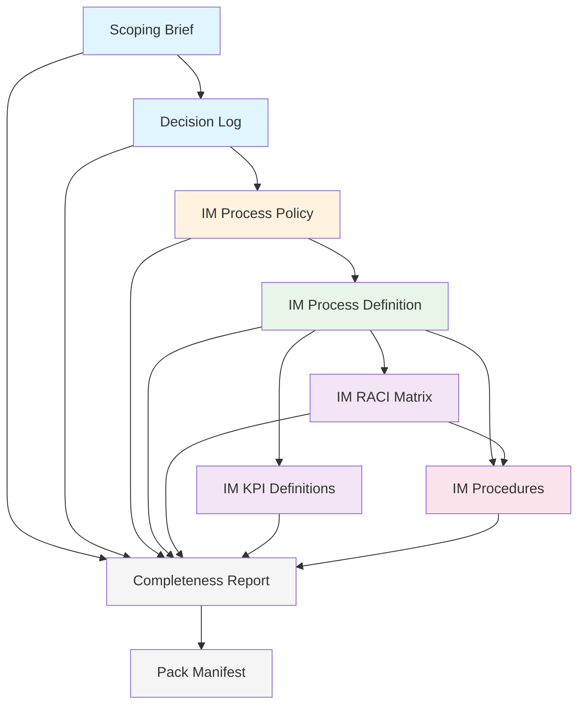

# Documentation Pack Manifest

## 1. Pack Summary

| Attribute | Value |
|-----------|-------|
| **Organization** | Acme IT Services |
| **Tier** | T1 (Single Process) |
| **Framework** | FitSM v3 |
| **Total Documents** | 9 |
| **Pack Version** | 1.0 |
| **Assembly Date** | 2026-03-15 |
| **Status** | Complete — all gates passed |

## 2. Document Inventory

| # | Document Title | Category | Process ID | Status | Version | File |
|---|---------------|----------|-----------|:------:|---------|------|
| 1 | Scoping Brief | scoping-brief | — | review | 0.1 | acme-scoping-brief.md |
| 2 | Decision Log | decision-log | — | review | 0.1 | acme-decision-log.md |
| 3 | Incident Management Policy | process-policy | PR11 | review | 0.1 | acme-im-process-policy.md |
| 4 | Incident Management — Process Definition | process-definition | PR11 | review | 0.1 | acme-im-process-definition.md |
| 5 | Incident Management — RACI Matrix | raci-matrix | PR11 | review | 0.1 | acme-im-raci-matrix.md |
| 6 | Incident Management — KPI Definitions | kpi-definition | PR11 | review | 0.1 | acme-im-kpi-definitions.md |
| 7 | Incident Management — Procedures | procedure | PR11 | review | 0.1 | acme-im-procedures.md |
| 8 | Completeness Report | completeness-report | — | review | 0.1 | acme-completeness-report.md |
| 9 | Documentation Pack Manifest | documentation-pack-manifest | — | review | 1.0 | acme-documentation-pack-manifest.md |

## 3. Dependency Graph

**Layer order:**
- Layer 0: SMS Policy — N/A (T2+ only)
- Layer 1: Process Policy (acme-im-process-policy.md)
- Layer 2: Process Definition (acme-im-process-definition.md)
- Layer 3: RACI Matrix + KPI Definitions
- Layer 4: Procedures (acme-im-procedures.md)

## 4. Shared Contract Index

| Contract | Defined In | Referenced By |
|----------|-----------|--------------|
| Role Definitions (IM, SDA, TS) | RACI Matrix §1 | Process Policy §5, Process Definition §6, Procedures §3 |
| Priority Matrix (P1-P4) | Decision Log D-1 | Process Definition §8 + Priority Matrix section, KPI Definitions (SLA targets), Procedures PROC-IM-01 Step 4 |
| Major Incident Criteria | Decision Log D-2 | Process Policy §3, Process Definition §11, Procedures PROC-IM-02 Step 1 |
| Escalation Model | Decision Log D-3 | Process Definition §11, Procedures PROC-IM-01 Step 4, RACI Matrix (escalation activities) |
| Classification Scheme | Decision Log D-5 | Process Definition §4, Procedures PROC-IM-01 Step 3 |
| SLA Resolution Targets | Decision Log D-6 | KPI Definitions (all KPIs), Process Definition §8 |
| ITSM Glossary | Decision Log §4 | All documents (consistent terminology) |

## 5. Decision Distribution Index

| Decision ID | Title | Distributed To | Status |
|------------|-------|----------------|--------|
| D-1 | Priority Matrix Model | Process definition, procedures, KPI definitions | Distributed |
| D-2 | Major Incident Criteria | Process policy, process definition, procedures, RACI | Distributed |
| D-3 | Escalation Model | Process definition, procedures, RACI | Distributed |
| D-4 | Role Assignments | Process policy, process definition, RACI, procedures | Distributed |
| D-5 | Classification Scheme | Process definition, procedures | Distributed |
| D-6 | SLA Resolution Targets by Priority | KPI definitions, process definition, procedures | Distributed |
| D-7 | FitSM Split Process Handling | Process policy, process definition | Distributed |

## 6. Approval Summary

| Document | Approved By | Date |
|----------|------------|------|
| All documents | Maria Chen (IT Director) | 2026-03-15 (simulated) |
| All documents | Tom Weber (Service Desk Lead) | 2026-03-15 (simulated) |

## 7. Export Formats

| Format | Location | Date Generated |
|--------|----------|---------------|
| Markdown | docs/itsm/e2e-demo/ | 2026-03-15 |
