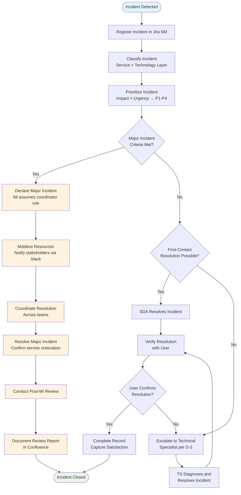

# Incident Management — Process Definition

<!-- Layer 2 document — defines WHAT the process does, WHO is involved, and WHEN it operates. -->

## 1. Purpose

To minimize the negative impact of incidents on Acme IT Services' clients and internal operations by restoring normal service operation as quickly as possible. This process ensures that incidents — unplanned interruptions to a service or reductions in the quality of a service — are detected, registered, classified, prioritized, diagnosed, resolved, and closed using a consistent, repeatable approach. It encompasses both the operational handling of individual incidents and the coordinated response to major incidents.

## 2. Scope

### 2.1 In Scope

- All incidents affecting the approximately 12 services managed by Acme IT Services from the Munich site
- Incidents reported by users (phone, email, Jira SM portal, Slack) and detected through Datadog monitoring and alerting
- The full incident lifecycle: detection, registration, classification, prioritization, diagnosis, resolution, and closure
- Major incidents requiring coordinated response per the criteria defined in this document
- Classification using a two-dimensional scheme (Service x Technology Layer)
- Prioritization using a 4-level priority matrix (P1-P4)
- 3-tier functional escalation and hierarchical escalation paths

### 2.2 Out of Scope

- **Service Request Management (PR12):** Service requests are tagged separately in Jira Service Management and are not covered by this process (ref: D-7)
- **Problem Management (PR13):** Root cause investigation and KEDB maintenance are future-scope processes. Recurring incidents are flagged for future problem investigation
- **Change Management (PR15):** Change control is a future-scope process. Where a change is needed to resolve an incident, it is noted in the incident record for future RFC processing
- **Incident Models:** Pre-defined incident models are a T2+ capability and are not in scope for this T1 implementation

## 3. Triggers & Inputs

| Trigger / Input | Source | Description |
|----------------|--------|-------------|
| User-reported incident | Users via Service Desk (phone, email, Jira SM portal, Slack) | A user contacts the Service Desk to report a service disruption or quality degradation |
| Monitoring alert | Datadog | An automated alert indicates service degradation, threshold breach, or component failure |
| Technical observation | Technical Specialists | IT staff observe an issue during routine operations or maintenance |
| SLA targets | Service Level Management (PR02) | Agreed response and resolution targets that drive prioritization and escalation timing |
| Configuration item data | Service Configuration Management (PR17) | CI data in Jira SM / CMDB to support classification and impact analysis |

## 4. Activities

| # | Activity | Description | Responsible Role |
|---|----------|-------------|-----------------|
| 1 | Detect incidents | Identify incidents through Datadog alerts, user reports via Service Desk channels, or technical observation. Detect as early as possible, ideally before users are affected | SDA / TS |
| 2 | Register incidents | Log each incident in Jira Service Management with required fields: title, affected user(s), affected service or CI, impact, urgency, priority, time of first symptom, and detection source | SDA |
| 3 | Classify and prioritize incidents | Categorize using the 2D classification scheme (Service x Technology Layer). Assess impact and urgency to determine priority using the P1-P4 priority matrix. Check against major incident criteria | SDA |
| 4 | Diagnose incidents | Investigate to determine cause and identify resolution. Use available knowledge articles, configuration data, and diagnostic tools. Engage Technical Specialists for incidents beyond first-contact capability | TS |
| 5 | Resolve incidents | Apply fix or workaround to restore normal service. Confirm service restoration with user. Document resolution actions in Jira SM | TS |
| 6 | Close incidents | Verify resolution with user and obtain confirmation. Complete incident record with resolution details, timestamps, and final categorization. Determine if issue should be flagged for future problem investigation or change request | SDA |
| 7 | Manage major incidents | When major incident criteria are met: IM assumes coordinator role, mobilizes resources, communicates to stakeholders via Slack, coordinates resolution across teams, conducts post-major-incident review, documents review in Confluence | IM |

## 5. Outputs

| Output | Destination | Description |
|--------|------------|-------------|
| Incident records (new and updated) | Jira Service Management | Complete record of each incident through its lifecycle |
| Major incident review reports | Confluence -> Management, service owners | Formal report with timeline, actions, root cause (if known), lessons learned, follow-up actions |
| Incident data for future problem investigation | Flagged in Jira SM for PR13 (future) | Recurring incidents and unresolved root causes flagged for future problem management |
| Incident data for future change requests | Flagged in Jira SM for PR15 (future) | Incidents requiring infrastructure changes flagged for future change management |
| User satisfaction data | Jira SM post-resolution survey | Satisfaction feedback captured at incident closure |
| Monthly incident reports | Management, service owners | Volume, SLA achievement, backlog trends, major incident summaries |

## 6. Roles & Responsibilities

| Role | Responsibility |
|------|---------------|
| **Incident Manager (IM)** — Tom Weber, Service Desk Lead | Accountable for all incident management activities. Coordinates incident handling across Service Desk and technical teams. Monitors resolution performance. Declares and coordinates major incidents (acting as coordinator at T1). Conducts post-major-incident reviews. Also serves as Process Owner. Reports to IT Director |
| **Service Desk Agent (SDA)** — Service Desk team (8 staff) | First point of contact for user-reported incidents. Registers incidents in Jira SM, performs initial classification and prioritization, attempts first-contact resolution, escalates incidents beyond first-contact capability, manages incident closure including user confirmation |
| **Technical Specialist (TS)** — Infrastructure & Applications teams | Provides domain-specific expertise for incident diagnosis and resolution (Infrastructure layer, Application layer). Participates in major incident resolution when mobilized by IM. Contributes resolution knowledge for future documentation |

> **Note:** At T1, no dedicated Major Incident Manager (MIM) or Service Owner (SO) roles exist. The Incident Manager performs major incident coordination directly. The MIM role is a T2+ capability.

## 7. Process Interfaces

| Interface | Direction | Connected Process | Description |
|-----------|-----------|------------------|-------------|
| SLA targets | In | PR02 Service Level Management | SLA targets drive incident prioritization and escalation timescales |
| Incident trends for problem investigation | Out | PR13 Problem Management (future) | Recurring incidents and unresolved root causes flagged for future problem investigation |
| Change requests for permanent fixes | Out | PR15 Change Management (future) | Incidents requiring infrastructure/application changes flagged for future RFC processing |
| CI and service data | In | PR17 Service Configuration Management | Configuration item data supports incident classification, impact analysis, and diagnosis |
| Service request separation | Bidirectional | PR12 Service Request Management | Incidents and service requests share Jira SM but are tagged separately per D-7. FitSM combines these as ISRM (PR9); Acme documents them as separate processes |
| Monitoring alerts | In | Datadog (tooling) | Automated alerts trigger incident detection |
| Stakeholder communication | Out | Slack / Email | Incident status updates and major incident communications |

## 8. KPIs & Metrics

| KPI | Target | Measurement Method | Reporting Period |
|-----|--------|-------------------|-----------------|
| Mean Incident Resolution Time (MTTR) | Within SLA targets per priority: P1 <= 4hr, P2 <= 8hr, P3 <= 24hr, P4 <= 5 business days | Jira SM: resolution timestamp - detection timestamp | Monthly |
| Incident Resolution Within SLA Target Rate | >= 90% | Jira SM: % resolved within SLA target for each priority | Monthly |
| First-Contact Resolution Rate | >= 60% | Jira SM: % resolved at first contact without escalation | Monthly |
| Incident Backlog Size and Trend | Stable or trending downward | Jira SM: open incident count at period end, period-over-period change | Monthly |

## 9. Tools & Systems

| Tool | Purpose | Owner |
|------|---------|-------|
| Jira Service Management | Incident registration, classification, prioritization, assignment, tracking, resolution, closure. SLA clock management. Reporting and dashboards | Tom Weber (IM) |
| Datadog | Infrastructure and application monitoring, alerting, event correlation. Triggers automated incident detection | Infrastructure Team Lead |
| Slack | Real-time communication during incident handling. Major incident coordination channel. Stakeholder notifications | Tom Weber (IM) |
| Confluence | Knowledge articles, resolution guides, major incident review reports, process documentation | Tom Weber (IM) |

## 10. Process Flow

## 11. Priority Matrix

### Impact × Urgency Grid (D-1)

Incidents are prioritized using a 4-level priority system (P1-P4) derived from a 3x3 Impact x Urgency grid:

| | **Urgency: High** | **Urgency: Medium** | **Urgency: Low** |
|---|:---:|:---:|:---:|
| **Impact: High** | P1 — Critical | P2 — High | P3 — Medium |
| **Impact: Medium** | P2 — High | P3 — Medium | P4 — Low |
| **Impact: Low** | P3 — Medium | P4 — Low | P4 — Low |

**Impact Assessment Criteria:**

| Impact Level | Criteria |
|-------------|----------|
| High | Multiple users/teams affected; business-critical service unavailable; external client impact; revenue or contractual impact |
| Medium | Single team or limited users affected; non-critical service degraded; workaround available but inconvenient |
| Low | Single user affected; non-critical service; minimal business impact; workaround readily available |

**Urgency Assessment Criteria:**

| Urgency Level | Criteria |
|--------------|----------|
| High | Immediate business need; no workaround; SLA breach imminent; external client deadline at risk |
| Medium | Business need within business hours; workaround available but limited; SLA approaching threshold |
| Low | No immediate business pressure; acceptable workaround in place; no SLA risk |

### SLA Targets by Priority (D-6)

| Priority | Response Target | Resolution Target | Service Hours |
|----------|----------------|-------------------|---------------|
| P1 — Critical | 15 minutes | 4 hours | 24/7 |
| P2 — High | 30 minutes | 8 hours | Business hours (Mon-Fri 08:00-18:00 CET) |
| P3 — Medium | 2 hours | 24 hours | Business hours (Mon-Fri 08:00-18:00 CET) |
| P4 — Low | 4 hours | 5 business days | Business hours (Mon-Fri 08:00-18:00 CET) |

### Major Incident Criteria (D-2)

An incident shall be classified as a major incident if any of the following conditions are met:

1. Priority is P1 (Critical)
2. Two or more services are simultaneously affected
3. An external client-facing service is completely unavailable
4. The IT Director or Service Desk Lead (Tom Weber) explicitly declares a major incident

### Classification Scheme (D-5)

Incidents are classified using a two-dimensional scheme:

**Dimension 1 — Service:** One of the approximately 12 managed services (e.g., Email, ERP, Client VPN, Web Hosting, etc.)

**Dimension 2 — Technology Layer:**

| Layer | Description | Examples |
|-------|------------|---------|
| Infrastructure | Network, server, storage, data center components | Server down, network outage, storage failure |
| Application | Software, middleware, database, integration components | Application error, database corruption, API failure |
| End User | Workstation, endpoint, user account, access components | Login failure, workstation issue, printer problem |

### Escalation Model (D-3)

**Functional Escalation (3 tiers):**

| Level | Resolver | Escalation Trigger |
|-------|----------|-------------------|
| L1 | Service Desk Agent (SDA) | First point of contact; attempts first-contact resolution |
| L2 | Technical Specialist (TS) | Incident cannot be resolved at L1; requires specialist expertise |
| L3 | Team Lead | Incident requires architectural decision, vendor engagement, or cross-team coordination beyond TS capability |

**Hierarchical Escalation:**

| Level | Escalated To | Escalation Trigger |
|-------|-------------|-------------------|
| H1 | Service Desk Lead / Incident Manager (Tom Weber) | SLA breach risk; resource conflict; priority dispute |
| H2 | IT Director | Major incident coordination; organizational escalation; unresolved SLA breach |

**Escalation Timescales:**

| Priority | L2 Functional Escalation | Hierarchical Escalation |
|----------|-------------------------|------------------------|
| P1 — Critical | 15 minutes | 30 minutes |
| P2 — High | 1 hour | Not automatic; on SLA risk |
| P3 — Medium | 4 hours | Not automatic; on SLA risk |
| P4 — Low | 1 business day | Not automatic; on SLA risk |

## 12. Exceptions & Escalations

| Exception | Trigger | Escalation Path | Resolution |
|-----------|---------|----------------|------------|
| Major incident declared | Any major incident criterion met (D-2) | IM assumes coordinator role; IT Director informed within 30 min | Follow PROC-IM-02 (Major Incident Handling) |
| SLA breach imminent | Resolution target approaching with no resolution in sight | Hierarchical escalation to IM, then IT Director | IM reallocates resources or escalates to IT Director for decision |
| Resource conflict | Multiple P1/P2 incidents competing for same TS resources | IM arbitrates; IT Director if unresolved | IM prioritizes based on business impact; IT Director makes final call |
| Unresolvable incident | All diagnostic paths exhausted; no resolution or workaround identified | IM escalates to IT Director; vendor engagement if applicable | IT Director authorizes additional resources, vendor engagement, or service-level communication to affected clients |

## 13. Related Documents

| Document | Relationship |
|----------|-------------|
| acme-im-process-policy.md | Parent policy — strategic intent and governing principles |
| acme-im-procedures.md | Child procedures — step-by-step handling and major incident procedures |
| acme-im-raci-matrix.md | RACI matrix — role-activity assignments for all activities |
| acme-im-kpi-definitions.md | KPI definitions — metrics, targets, and RAG thresholds |
| Service Request Management (PR12) | Related — service requests tagged separately in Jira SM per D-7 |
| Problem Management (PR13) | Interface (future) — recurring incidents flagged for future problem investigation |
| Change Management (PR15) | Interface (future) — incidents requiring changes flagged for future RFC processing |

## 14. FitSM Requirements Traceability

This section maps the FitSM-1 process-specific requirements for PR9 (ISRM — incident scope) to the sections and artefacts in this process definition.

| FitSM-1 Requirement | Requirement Description | Addressed By |
|---------------------|------------------------|--------------|
| PR9.1 | Incidents and service requests shall be registered | Section 4, Activity 2 (Register incidents); Jira SM as ITSM tool |
| PR9.2 | Incidents and service requests shall be classified and prioritized based on a defined scheme | Section 4, Activity 3; Section 11 (Priority Matrix, Classification Scheme) |
| PR9.3 | Incidents and service requests shall be resolved or fulfilled and closed | Section 4, Activities 5-6 (Resolve and Close incidents) |
| PR9.4 | Users shall be kept informed of incident/request status as appropriate | Section 4, Activity 6 (user confirmation at closure); PROC-IM-01 Steps 6-7; Slack for major incidents |
| PR9.5 | Functional and hierarchical escalation shall be performed in a consistent manner per defined rules | Section 11, Escalation Model (D-3); 3-tier functional + hierarchical escalation paths |
| PR9.6 | Major incidents shall be identified based on defined criteria and handled consistently using a dedicated procedure | Section 11, Major Incident Criteria (D-2); Section 4, Activity 7; PROC-IM-02 |

> **Note:** FitSM PR9 combines Incident Management and Service Request Management into a single ISRM process. Per decision D-7, Acme IT Services documents these as separate processes (PR11 and PR12), with service requests tagged separately in Jira Service Management.

## 15. FitSM Role Mapping

This section maps the roles defined in this process to the FitSM-3 role model.

| Acme Role | FitSM-3 Role | FitSM-3 Description | Notes |
|-----------|-------------|---------------------|-------|
| Incident Manager (IM) — Tom Weber | ISRM Manager (Process Manager) | Ensures all incidents are recorded with sufficient quality. Monitors resolution progress and identifies potential SLA violations | At T1, IM also serves as Process Owner. Combined with Service Desk Lead role |
| Incident Manager (IM) — Tom Weber | ISRM Process Owner | Accountable for strategic direction and fitness for purpose of the ISRM process | Combined with ISRM Manager at T1 |
| Incident Manager (IM) — Tom Weber | Major Incident Manager | Leads response to major incidents, coordinates resolution teams, manages stakeholder communication | At T1, IM performs major incident coordination directly. Dedicated MIM role is a T2+ capability |
| Service Desk Agent (SDA) | Case Owner (for assigned incidents) | Overall responsibility for managing a specific incident through its lifecycle | SDA owns the incident ticket from registration to closure |
| Technical Specialist (TS) | (No direct FitSM-3 equivalent) | Domain specialists providing expertise for diagnosis and resolution | TS roles are organizational; FitSM-3 does not prescribe technical specialist roles explicitly |
