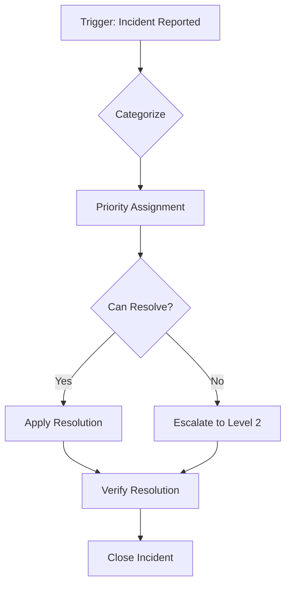
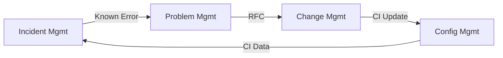

# 3PA Tooling Guide

> Documentation production tools, export pipelines, and diagram rendering for ITSM documentation packs.

## 1. Authoring Environment

### Markdown Editors

3PA produces all documents in Markdown format. Any Markdown editor works; recommended:

- **VS Code** with Markdown preview — native Mermaid rendering
- **Obsidian** — graph view for cross-reference visualization
- **Typora** — WYSIWYG Markdown with Mermaid support

### File Organization

All artifacts are saved to `docs/itsm/` within the target project. The directory structure mirrors the document hierarchy:

```
docs/itsm/
├── scoping-brief.md
├── decision-log.md
├── {org}-sms-policy.md
├── {org}-{process-id}-process-policy.md
├── {org}-{process-id}-process-definition.md
├── {org}-{process-id}-procedure.md
├── {org}-raci-matrix.md
├── {org}-kpi-definition.md
├── {org}-sla-template.md
├── {org}-ola-template.md
├── {org}-service-catalogue-entry.md
├── {org}-risk-register.md
├── {org}-csi-register.md
├── completeness-report.md
├── documentation-pack-manifest.md
└── document-library.md
```

## 2. Diagram Rendering

### Mermaid

3PA uses Mermaid syntax for all diagrams within Markdown fenced blocks. Common diagram types:

| Diagram Type | Use Case | Tier |
|-------------|----------|:----:|
| Flowchart | Process activity flows | All |
| Sequence | Process interactions, escalations | T2+ |
| State | Ticket/CI lifecycle states | T2+ |
| Gantt | Implementation timelines | T3 |
| C4 Context | Service architecture overview | T3 |

#### Example: Process Flow

````markdown

````

#### Example: Process Interfaces

````markdown

````

### Rendering Options

- **GitHub** — Native Mermaid rendering in `.md` files
- **VS Code** — Mermaid extension for preview
- **CLI Export** — Use `mmdc` (mermaid-cli) for SVG/PNG/PDF export:

```bash
npx @mermaid-js/mermaid-cli -i input.md -o output.svg
```

## 3. RACI Matrix Generation

### Format

RACI matrices use Markdown tables:

```markdown
| Activity | Process Owner | Service Desk | Technical Lead | Change Manager |
|----------|:---:|:---:|:---:|:---:|
| Log incident | I | R | — | — |
| Categorize | I | R | C | — |
| Investigate | I | — | R | — |
| Resolve | A | — | R | — |
| Close | A | R | I | — |
```

### Validation Rules

- Exactly one **A** per row
- At least one **R** per row
- Valid values: R, A, C, I, — (dash for no involvement)

## 4. Export Pipelines

### PDF Export

Using pandoc with a LaTeX engine:

```bash
pandoc docs/itsm/{org}-{doc}.md -o output.pdf \
  --pdf-engine=xelatex \
  --template=template.tex \
  -V geometry:margin=1in
```

For Mermaid diagrams in PDF, pre-render to SVG first:

```bash
mmdc -i input.md -o temp.md -e svg
pandoc temp.md -o output.pdf
```

### DOCX Export

```bash
pandoc docs/itsm/{org}-{doc}.md -o output.docx \
  --reference-doc=reference.docx
```

### Wiki Import

#### Confluence

- Use the Markdown-to-Confluence converter
- Mermaid diagrams render natively in Confluence Cloud
- For Confluence Server, export diagrams as PNG first

#### SharePoint

- Convert to DOCX first, then upload
- Or use SharePoint's Markdown web part

### Bulk Export

For T3 packs with 50+ documents:

```bash
# Export all docs to PDF
for f in docs/itsm/*.md; do
  pandoc "$f" -o "${f%.md}.pdf" --pdf-engine=xelatex
done
```

## 5. Version Control

### Git Integration

ITSM documentation should be version-controlled:

```bash
git init
git add docs/itsm/
git commit -m "Initial ITSM documentation pack"
```

### Change Tracking

- Use `git diff` to track changes between versions
- Increment document `version` field in frontmatter on significant changes
- Use conventional commit messages: `docs(itsm): update PR9 incident procedure`

## 6. Quality Assurance Tools

### Frontmatter Validation

YAML frontmatter can be validated with standard YAML linters:

```bash
# Check YAML validity
npx js-yaml docs/itsm/{doc}.md
```

### Link Checking

Verify cross-references between documents:

```bash
# Find broken internal links
grep -rn '\[.*\](.*\.md)' docs/itsm/ | while read line; do
  target=$(echo "$line" | grep -oP '\(.*?\.md\)')
  # Check if target exists
done
```

### Mermaid Validation

```bash
# Validate Mermaid syntax
npx @mermaid-js/mermaid-cli -i input.md --validate
```

## 7. Cross-References

- Document naming: `3PA-Document-Taxonomy.md` §5
- Diagram requirements by tier: `3PA-Document-Taxonomy.md` §1
- Quality gate procedures: `3PA-Quality-Gates.md`
- Phase procedures: `3PA-Phase-Guide.md`
