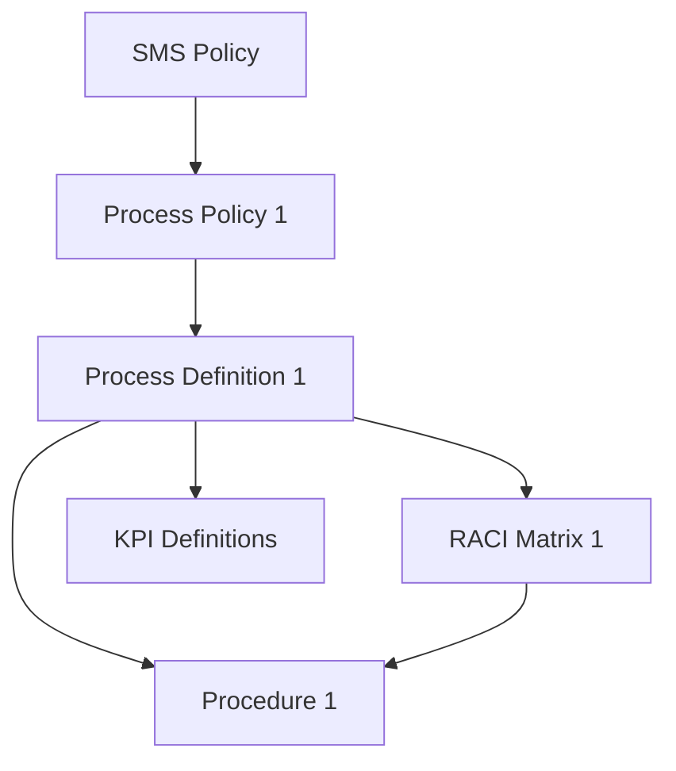

# Documentation Pack Manifest

<!-- P5 output — complete inventory of the ITSM documentation pack. -->

## 1. Pack Summary

| Attribute | Value |
|-----------|-------|
| **Organization** | |
| **Tier** | |
| **Framework** | |
| **Total Documents** | |
| **Pack Version** | |
| **Assembly Date** | |
| **Status** | |

## 2. Document Inventory

| # | Document Title | Category | Process ID | Status | Version | File |
|---|---------------|----------|-----------|:------:|---------|------|
| | | | | | | |

## 3. Dependency Graph

<!-- Mermaid diagram showing document dependencies -->

## 4. Shared Contract Index

| Contract | Defined In | Referenced By |
|----------|-----------|--------------|
| | | |

## 5. Decision Distribution Index

| Decision ID | Title | Distributed To | Status |
|------------|-------|----------------|--------|
| | | | |

## 6. Approval Summary

| Document | Approved By | Date |
|----------|------------|------|
| | | |

## 7. Export Formats

| Format | Location | Date Generated |
|--------|----------|---------------|
| | | |
