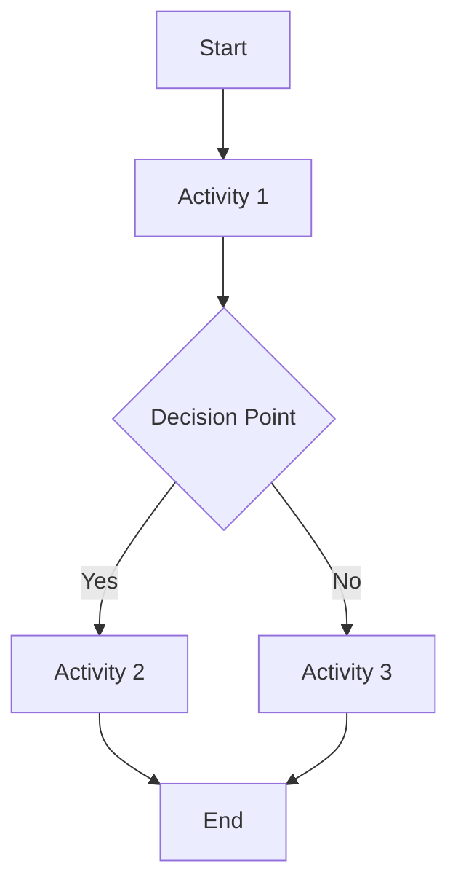

# {Process Name} — Process Definition

<!-- Layer 2 document — the most-instantiated template (up to 14 at T3).
     Defines WHAT the process does, WHO is involved, and WHEN it operates.
     Author in Phase A→B→C→D interdependency order. -->

## 1. Purpose

<!-- Why this process exists and what value it delivers -->

## 2. Scope

<!-- What is in scope and out of scope for this process -->

### 2.1 In Scope
### 2.2 Out of Scope

## 3. Triggers & Inputs

<!-- What initiates this process and what data/artifacts it receives -->

| Trigger / Input | Source | Description |
|----------------|--------|-------------|
| | | |

## 4. Activities

<!-- Ordered list of process activities -->

| # | Activity | Description | Responsible Role |
|---|----------|-------------|-----------------|
| | | | |

## 5. Outputs

<!-- What this process produces and where it goes -->

| Output | Destination | Description |
|--------|------------|-------------|
| | | |

## 6. Roles & Responsibilities

<!-- Roles involved in this process — must match RACI matrix -->

| Role | Responsibility |
|------|---------------|
| | |

## 7. Process Interfaces

<!-- How this process connects to other processes -->

| Interface | Direction | Connected Process | Description |
|-----------|-----------|------------------|-------------|
| | In / Out | | |

## 8. KPIs & Metrics

<!-- Key Performance Indicators for this process — must match KPI definitions -->

| KPI | Target | Measurement Method | Reporting Period |
|-----|--------|-------------------|-----------------|
| | | | |

## 9. Tools & Systems

<!-- Tools and systems that support this process -->

| Tool | Purpose | Owner |
|------|---------|-------|
| | | |

## 10. Process Flow

<!-- Mermaid diagram of the process flow -->

## 11. Exceptions & Escalations

<!-- How exceptions are handled and when escalation occurs -->

| Exception | Trigger | Escalation Path | Resolution |
|-----------|---------|----------------|------------|
| | | | |

## 12. Related Documents

| Document | Relationship |
|----------|-------------|
| | Parent policy |
| | Child procedures |
| | RACI matrix |
| | KPI definitions |
